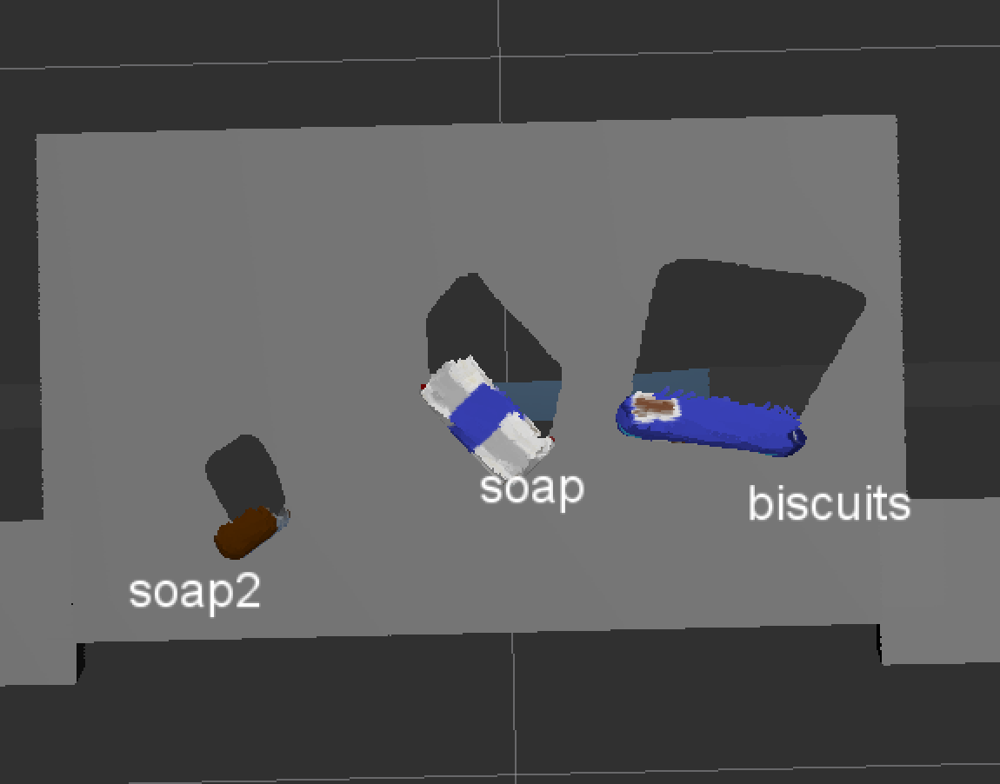

## Project: Perception Pick & Place

## [Rubric](https://review.udacity.com/#!/rubrics/1067/view) Points
### Here I will consider the rubric points individually and describe how I addressed each point in my implementation.  

---
### Writeup / README

#### 1. Provide a Writeup / README that includes all the rubric points and how you addressed each one.  You can submit your writeup as markdown or pdf.  

You're reading it!

### Exercise 1, 2 and 3 pipeline implemented
#### 1. Complete Exercise 1 steps. Pipeline for filtering and RANSAC plane fitting implemented.

Please see the [implementation in project_template.py](https://github.com/realcraig/RoboND-Perception-Project/blob/master/pr2_robot/scripts/project_template.py).

Here's a picture of the table top after applying pass through and RANSAC filtering with plane fitting. I used two pass through fitlers, the first along the z axis to remove everything but the table top and objects and the second along the x axis to remove the front of the table.

#### 2. Complete Exercise 2 steps: Pipeline including clustering for segmentation implemented.  

The image below shows clustering and segmentation applied to the three objects in test 1.

#### 2. Complete Exercise 3 Steps.  Features extracted and SVM trained.  Object recognition implemented.

I extracted features from the objects using 100 poses for each object. This resulted in an accuracy score of about 0.95. Here's my normalized confusion matrix.

I implemented recognition and applied it to test worlds 1, 2, and 3.

### Pick and Place Setup

#### 1. For all three tabletop setups (`test*.world`), perform object recognition, then read in respective pick list (`pick_list_*.yaml`). Next construct the messages that would comprise a valid `PickPlace` request output them to `.yaml` format.

Please see the included yaml files for output from the three test scenarios.

[output_1.yaml](https://github.com/realcraig/RoboND-Perception-Project/blob/master/output_1.yaml)
[output_2.yaml](https://github.com/realcraig/RoboND-Perception-Project/blob/master/output_2.yaml)
[output_3.yaml](https://github.com/realcraig/RoboND-Perception-Project/blob/master/output_3.yaml)

### Discussion

Spend some time at the end to discuss your code, what techniques you used, what worked and why, where the implementation might fail and how you might improve it if you were going to pursue this project further.  

#### 1. Feature extraction and training

I used HSV color space for feature extraction to minimize variance from different lighting conditions.

I experimented with different numbers of iterations for feature extraction and generally found that more iterations lead to more accuracy, though returns begin to diminish at high numbers of iterations. It seems as though 100 iterations was sufficient for this task, but a higher number of iterations would ensure greater accuracy and may be needed with less differentiable objects. Since feature extraction is a one time operation, I see no downside to training with a larger number of features.

I also experimented with different kernel types for the SVN classifier. Although the literature suggested that RBF may provide more accurate boundaries, I saw higher accuracy from the linear kernel and therefore used that in my training.

#### 2. Filtering, Clustering & Segmentation

As described above, I added a second pass through filter to remove the sides of the drop boxes and the front edge of the table. Prior to adding this, the sides of the drop boxes were being detected as objects.

I experimented with the cluster sizes for object segmentation. Initially my min size was too large to detect the glue bottle and I had to lower it (I also decreased the voxel filter so more points would be in each object). This worked fine, but an improvement would be to design a more general algorithm that could detect objects with even fewer points, if present.

#### 3. Object recognition

This worked surprisingly well with my training data, although I noticed that every once in a while an object would be momentarily mis-recognized. More tuning of the training parameters and/or multiple passes on the recognition step could help reduce mis-recognition errors.

#### 4. YAML output

I added test_scene_num as a ROS parameter (following a suggestion on the forum) and stored it in a variable, so I didn't need to change code when I changed test worlds.

I created a dictionary with dropbox parameters and used the 'group' value as the key to lookup arm and place_pose.

#### 5. Future improvements

When I have time I would like to try the other challenges, including implementing full pick and place. In addition to the improvements noted above, I'd like to experiment with different ML algorithms (perhaps neural nets) for object recognition. 
